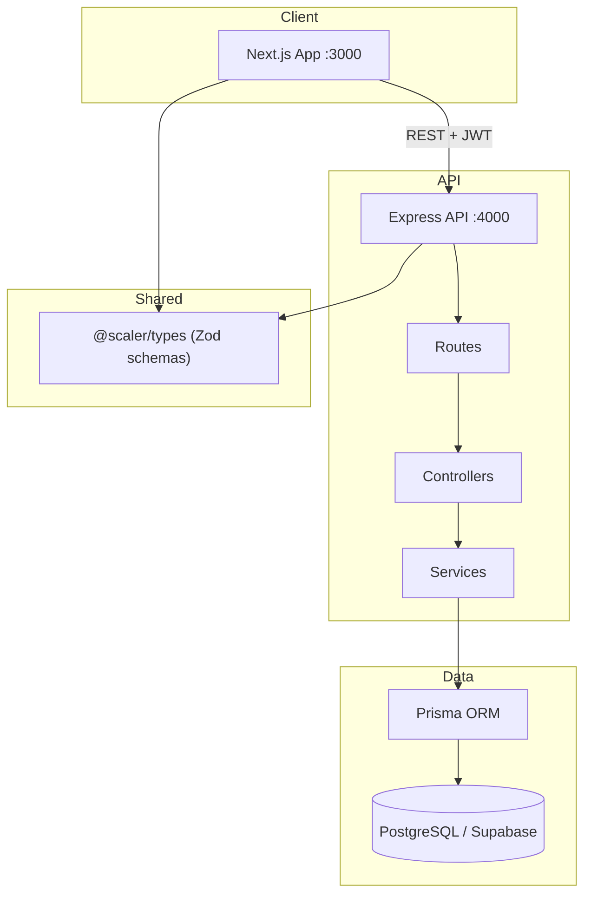

# Scaler — Scheduling Platform

A full-stack scheduling and booking application inspired by [Cal.com](https://cal.com). Hosts define event types and availability; guests book time slots via public pages. Built as a Scaler SDE Fullstack assignment with a production-oriented backend and a Cal.com-style frontend.

---

## Demo Login Credentials

After running the database seed, use these credentials to sign in manually at `/login`:

| Field    | Value                      |
| -------- | -------------------------- |
| Email    | `jagadeesh.m@deeptaai.com` |
| Password | `demo123!`                 |
| Username | `jagadeesh`                |

**Admin auto-login:** The dashboard does not require manual login. On load, the frontend calls `POST /api/v1/auth/bypass` and signs in as the seeded demo user automatically (assignment requirement: no login required for admin).

**Public booking pages** (no auth):

| Event type | URL                                   |
| ---------- | ------------------------------------- |
| 15 min     | http://localhost:3000/jagadeesh/15min |
| 30 min     | http://localhost:3000/jagadeesh/30min |

---

## Tech Stack

| Layer    | Technologies                                                                                    |
| -------- | ----------------------------------------------------------------------------------------------- |
| Frontend | Next.js 15, React 19, Tailwind CSS v4, shadcn/ui, TanStack Query, Zustand, React Hook Form, Zod |
| Backend  | Express 5, Prisma 7, PostgreSQL (Supabase), JWT, bcrypt, Pino                                   |
| Shared   | `@scaler/types` — Zod schemas and TypeScript types used by both apps                            |
| Tooling  | pnpm workspaces, Husky, ESLint, Prettier, Vitest                                                |

---

## Architecture

### High-level overview



### Backend request lifecycle

Every API request follows strict layering:

```text
HTTP Request
    → Router (route matching)
    → Validate middleware (Zod from @scaler/types)
    → Auth middleware (JWT, when protected)
    → Controller (extract req, call service)
    → Service (business logic)
    → Prisma → PostgreSQL
```

Errors are normalized through `AppError` and a global error handler; responses use a consistent `ApiResponse` envelope.

### Frontend structure

```text
App/
├── app/
│   ├── (authorised)/     # Dashboard — event types, bookings, availability, settings, apps
│   ├── (unauthorised)/     # Login & signup
│   └── [username]/[slug]/ # Public booking flow (no auth)
├── components/             # UI by feature (booking-page, event-types, availability, …)
├── hooks/                  # TanStack Query hooks (queries + mutations)
├── lib/                    # api client, routes, query keys, formatters
└── store/                  # Zustand (auth, UI state)
```

**State management:** Server data lives in TanStack Query; auth tokens and session UI state live in Zustand (`auth.store.ts`). The API client attaches JWT access tokens and refreshes via httpOnly refresh-token cookies.

### Shared type contract

`packages/types/` defines Zod schemas for auth, users, event types, availability, and bookings. The backend validates incoming requests with these schemas; the frontend uses the same schemas with React Hook Form. Inferred TypeScript types keep API request/response shapes in sync across the stack.

### Database models

Core entities: `User`, `EventType`, `Schedule`, `ScheduleAvailability`, `DateOverride`, `Booking`, `App`, `Credential`, `RefreshToken`, plus background job tables (`BackgroundJob`, `FailedJob`, `IdempotencyKey`).

Integration OAuth client secrets are stored encrypted (AES-256-GCM) in the `apps` table — not in `.env`.

---

## Monorepo layout

```text
Scaler/
├── App/                    # Next.js frontend
├── server/                 # Express backend
│   ├── prisma/             # Schema, migrations, seed
│   └── src/
│       ├── routes/
│       ├── controllers/
│       ├── services/
│       ├── middleware/
│       └── lib/
├── packages/types/         # Shared Zod schemas
├── docs/                   # Implementation plans & design tokens
└── task/ref/               # Cal.com UI reference screenshots
```

---

## Getting started

### Prerequisites

- Node.js 20+
- pnpm 9+
- PostgreSQL database (Supabase recommended)

### 1. Install dependencies

```bash
pnpm install
```

### 2. Environment setup

**Backend** — copy and fill in values:

```bash
cp server/.env.example server/.env
```

Required variables:

- `DATABASE_URL` — pooled connection (pgBouncer, port 6543)
- `DIRECT_URL` — direct connection for migrations (port 5432)
- `JWT_ACCESS_SECRET` / `JWT_REFRESH_SECRET` — min 32 characters each
- `ENCRYPTION_KEY` — 64-char hex string (32 bytes for AES-256-GCM)

Generate an encryption key:

```bash
node -e "console.log(require('crypto').randomBytes(32).toString('hex'))"
```

**Frontend:**

```bash
cp App/.env.example App/.env
```

### 3. Database setup

```bash
cd server
npx prisma generate
npx prisma db push
npx tsx prisma/seed.ts
```

The seed creates the demo user, default Mon–Fri 9–5 schedule (Asia/Kolkata), sample event types, and mock integration apps (Google, Zoom).

### 4. Run development servers

From the repo root:

```bash
# Terminal 1 — API
pnpm dev:backend    # http://localhost:4000

# Terminal 2 — Frontend
pnpm dev:frontend   # http://localhost:3000
```

Or from each package: `cd server && pnpm dev` and `cd App && pnpm dev`.

### 5. Verify

- Health check: http://localhost:4000/health
- Dashboard: http://localhost:3000/event-types (auto-authenticated)
- Manual login: http://localhost:3000/login
- Public booking: http://localhost:3000/jagadeesh/15min

---

## API overview

Base URL: `http://localhost:4000/api/v1`

| Area         | Endpoints                                                                                         |
| ------------ | ------------------------------------------------------------------------------------------------- |
| Auth         | `POST /auth/register`, `/login`, `/bypass`, `/refresh`, `/logout`                                 |
| Users        | `GET/PATCH /users/me`                                                                             |
| Event types  | CRUD + reorder at `/event-types`                                                                  |
| Availability | CRUD at `/availability`                                                                           |
| Bookings     | List/create/update at `/bookings`                                                                 |
| Integrations | `/integrations` (OAuth connect flow)                                                              |
| Public       | `GET /public/:username/event-types`, `/public/:username/:slug`, `/slots`, `/public/bookings/:uid` |

Slot calculation: `GET /slots?eventTypeId=...&date=YYYY-MM-DD&timezone=Asia/Kolkata`

---

## Scripts

| Command                              | Description                       |
| ------------------------------------ | --------------------------------- |
| `pnpm dev:backend`                   | Start Express API with nodemon    |
| `pnpm dev:frontend`                  | Start Next.js dev server          |
| `pnpm build`                         | Build types, server, and frontend |
| `pnpm lint`                          | Lint frontend and backend         |
| `pnpm typecheck`                     | Typecheck server                  |
| `cd server && pnpm test`             | Run backend unit tests            |
| `cd server && pnpm test:integration` | Run integration tests             |

---

## Key design decisions

- **Separate Express API** — Clear Routes → Controllers → Services layering; easier background jobs and integration webhooks than Next.js API routes alone.
- **UTC in database** — All timestamps stored in UTC; timezone conversion at the API edge and frontend.
- **Dynamic app store** — OAuth integrations configured in the database; credentials encrypted at rest.
- **Double-booking prevention** — Slot calculator checks availability rules, overrides, buffers, and existing bookings.
- **Auth bypass for demo** — Full JWT auth exists; dashboard uses bypass for assignment “no login” requirement.

---

## Further reading

- [Backend implementation plan](docs/backend-implementation-plan.md)
- [Frontend implementation plan](docs/frontend-implementation-plan.md)
- [Design tokens](docs/design-tokens.md)
- [Project conventions (CLAUDE.md)](CLAUDE.md)

---

## License

Private — Scaler SDE Fullstack Assignment.
